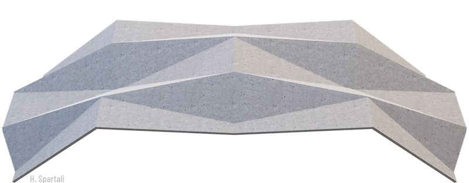
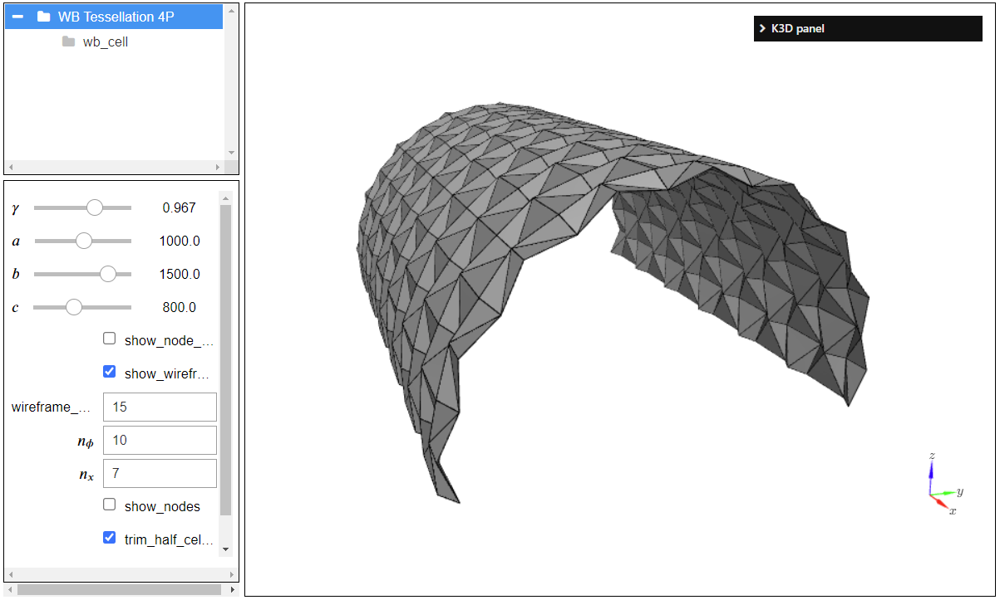
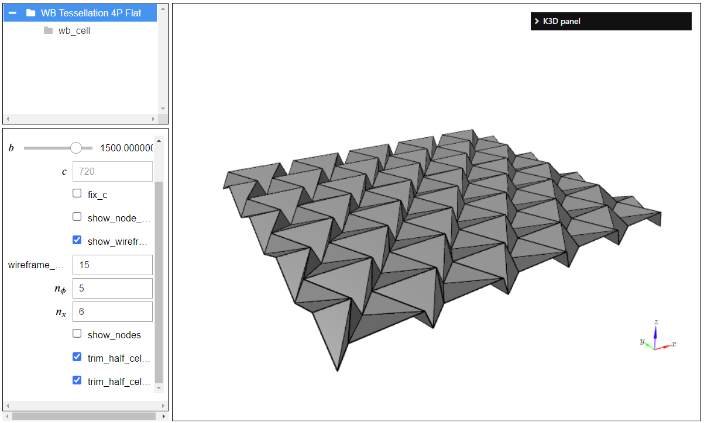
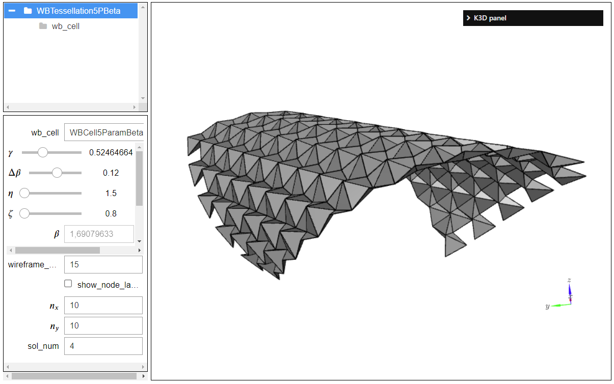

# BMCS Shells

Development framework for geometry development, numerical modeling, and production of brittle-matrix composite shells.
Currently, the focus is on developing flexible foldable shell geometries based on origami waterbomb patterns.

## Content
### Geometry
* **Waterbomb-based geometries**
  * Shells based on symmetric 4 parameters waterbomb base
  

  * Slabs based on Symmetric 4 parameters waterbomb base\
  

  * Shells based on semi-symmetric 5 parameters waterbomb base 
  

### Numerical structural analysis
Pending

### Production processes
Pending

## Installation

### Dependencies

Dependencies on `gmsh` and `pygmsh` included in `environment.yml` 
Anaconda versioning seems not up to date.

Problem with dependencies in `pyface` with a missing 
dependency on `anaconda` cloud. As a fix,`importlib-resources`
that was reported as missing has been included in environment.

